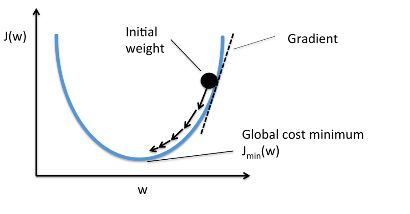
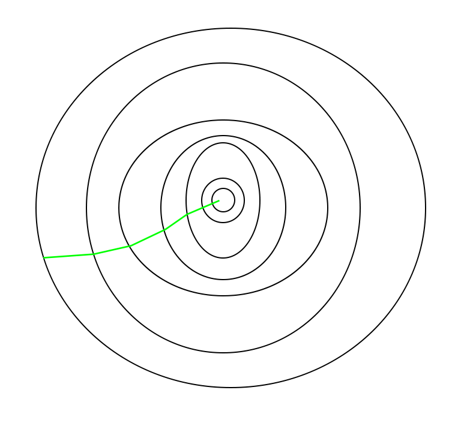
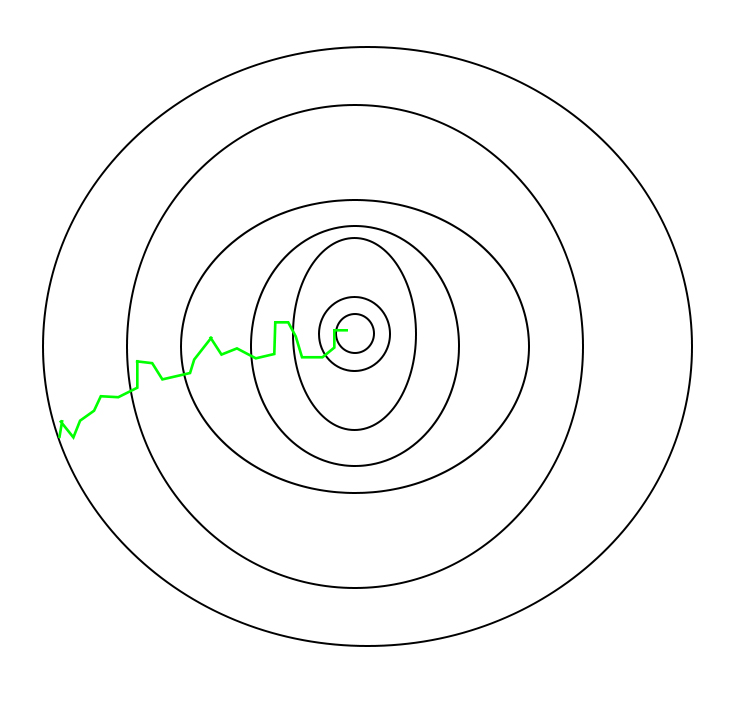

# Hyper-parameter-Tuning-Techniques-in-Deep-Learning
# 1.Gradient Descent
  * A gradient is basically the slope of a function; the degree of change of a parameter with the amount of change in another parameter. Mathematically, it can be described as the partial derivatives of a set of parameters with respect to its inputs. The more the gradient, the steeper the slope.
  * Gradient descent is an optimization algorithm used to minimize some function by iteratively moving in the direction of steepest descent as defined by the negative of the gradient. In machine learning, we use gradient descent to update the parameters of our model. Parameters refer to coefficients in Linear Regression and weights in neural networks.
  * Starting at the top of the mountain, we take our first step downhill in the direction specified by the negative gradient. Next we recalculate the negative gradient (passing in the coordinates of our new point) and take another step in the direction it specifies. We continue this process iteratively until we get to the bottom of our graph, or to a point where we can no longer move downhill–a local minimum ---Please refer to following figure:
      
 
 # Stochastic Gradient Descent (SGD)
   * The word ‘stochastic‘ means a system or a process that is linked with a random probability. Hence, in Stochastic Gradient Descent, a few samples are selected randomly instead of the whole data set for each iteration.
   * In Gradient Descent, there is a term called “batch” which denotes the total number of samples from a dataset that is used for calculating the gradient for each iteration.
   *  In typical Gradient Descent optimization, like Batch Gradient Descent, the batch is taken to be the whole dataset. Although, using the whole dataset is really useful for getting to the minima in a less noisy or less random manner, but the problem arises when our datasets get really huge.
   * Suppose, you have a million samples in your dataset, so if you use a typical Gradient Descent optimization technique, you will have to use all of the one million samples for completing one iteration while performing the Gradient Descent, and it has to be done for every iteration until the minima is reached. Hence, it becomes computationally very expensive to perform.
   * In SGD, since only one sample from the dataset is chosen at random for each iteration, the path taken by the algorithm to reach the minima is usually noisier than your typical Gradient Descent algorithm. But that doesn’t matter all that much because the path taken by the algorithm does not matter, as long as we reach the minima and with significantly shorter training time.
   # Path taken by Batch Gradient Descent – ->>  
   # Path taken by Stochastic Gradient Descent –> 
   
           
    
  
