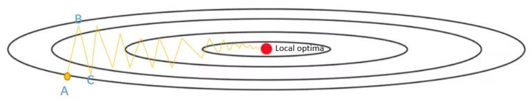
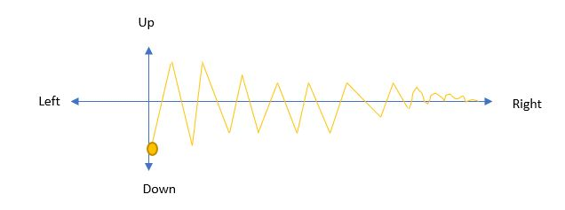
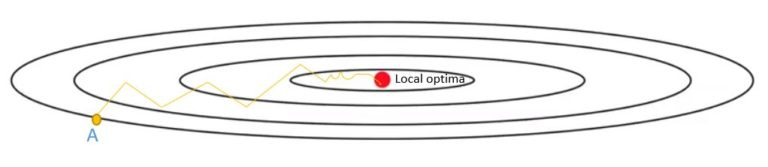

# Overview of different Optimizers for neural networks
# 1.Gradient Descent
  * A gradient is basically the slope of a function; the degree of change of a parameter with the amount of change in another parameter. Mathematically, it can be described as the partial derivatives of a set of parameters with respect to its inputs. The more the gradient, the steeper the slope.
  * Gradient descent is an optimization algorithm used to minimize some function by iteratively moving in the direction of steepest descent as defined by the negative of the gradient. In machine learning, we use gradient descent to update the parameters of our model. Parameters refer to coefficients in Linear Regression and weights in neural networks.
  * Starting at the top of the mountain, we take our first step downhill in the direction specified by the negative gradient. Next we recalculate the negative gradient (passing in the coordinates of our new point) and take another step in the direction it specifies. We continue this process iteratively until we get to the bottom of our graph, or to a point where we can no longer move downhill–a local minimum ---Please refer to following figure:
      
 
 # Stochastic Gradient Descent (SGD)
   * The word ‘stochastic‘ means a system or a process that is linked with a random probability. Hence, in Stochastic Gradient Descent, a few samples are selected randomly instead of the whole data set for each iteration.
   * In Gradient Descent, there is a term called “batch” which denotes the total number of samples from a dataset that is used for calculating the gradient for each iteration.
   *  In typical Gradient Descent optimization, like Batch Gradient Descent, the batch is taken to be the whole dataset. Although, using the whole dataset is really useful for getting to the minima in a less noisy or less random manner, but the problem arises when our datasets get really huge.
   * Suppose, you have a million samples in your dataset, so if you use a typical Gradient Descent optimization technique, you will have to use all of the one million samples for completing one iteration while performing the Gradient Descent, and it has to be done for every iteration until the minima is reached. Hence, it becomes computationally very expensive to perform.
   * In SGD, since only one sample from the dataset is chosen at random for each iteration, the path taken by the algorithm to reach the minima is usually noisier than your typical Gradient Descent algorithm. But that doesn’t matter all that much because the path taken by the algorithm does not matter, as long as we reach the minima and with significantly shorter training time.
   # Path taken by Batch Gradient Descent – ->>  
   # Path taken by Stochastic Gradient Descent –> 

# Gradient Descent with Momentum
  * Mini-batch gradient descent makes a parameter update with just a subset of examples, the direction of the update has some variance, and so the path taken by mini-batch gradient descent will “oscillate” toward convergence. Gradient Descent with Momentum considers the past gradients to smooth out the update. It computes an exponentially weighted average of your gradients, and then use that gradient to update your weights instead. It works faster than the standard gradient descent algorithm.
  
   # How does it work? 
   Consider an example where we are trying to optimize a cost function which has contours like below and the red dot denotes the position of the local optima (minimum).
  
  We start gradient descent from point ‘A’ and after one iteration of gradient descent we may end up at point ‘B’, the other side of the ellipse. Then another step of gradient descent may end up at point ‘C’. With each iteration of gradient descent, we move towards the local optima with up and down oscillations. If we use larger learning rate then the vertical oscillation will have higher magnitude. So, this vertical oscillation slows down our gradient descent and prevents us from using a much larger learning rate.
  
  
 By using the exponentially weighted average values of dW and db, we tend to average out the oscillations in the vertical direction closer to zero as they are in both directions (positive and negative). Whereas, on the horizontal direction, all the derivatives are pointing to the right of the horizontal direction, so the average in the horizontal direction will still be pretty big. It allows our algorithm to take more straight forwards path towards local optima and damp out vertical oscillations. Due to this reason, the algorithm will end up at local optima with a few iterations.    
 
#  How to Implement?

During backward propagation, we use dW and db to update our parameters W and b as follows:

W = W – learning rate * dW

b = b – learning rate * db

In momentum, instead of using dW and db independently for each epoch, we take the exponentially weighted averages of dW and db.

VdW = β x VdW + (1 – β) x dW

Vdb = β x Vdb + (1 – β) x db

Where beta ‘β’ is another hyperparameter called momentum and ranges from 0 to 1. It sets the weight between the average of previous values and the current value to calculate the new weighted average.

After calculating exponentially weighted averages, we will update our parameters.

W = W – learning rate *VdW

b = b – learning rate * Vdb

 # How to select beta?
  * The momentum (beta) must be higher to smooth out the update because we give more weight to the past gradients.
  *  It is recommended to use the default value for β = 0.9 but if required, it can be tuned between 0.8 to 0.999.
  *  Momentum takes past gradients into account to smooth out the steps of gradient descent. It can be applied with batch gradient    descent, mini-batch gradient descent or stochastic gradient descent.

# RMSProp
 * The RMSprop optimizer is similar to the gradient descent algorithm with momentum. The RMSprop optimizer restricts the oscillations in the vertical direction. Therefore, we can increase our learning rate and our algorithm could take larger steps in the horizontal direction converging faster. The difference between RMSprop and gradient descent is on how the gradients are calculated.
   
 # ADAM
  * Adam can be looked at as a combination of RMSprop and Stochastic Gradient Descent with momentum. It uses the squared gradients to scale the learning rate like RMSprop and it takes advantage of momentum by using moving average of the gradient instead of gradient itself like SGD with momentum
 ## Lets look how it works--
  *Adam as combining the advantages of two other extensions of stochastic gradient descent. Specifically:

  1. Adaptive Gradient Algorithm (AdaGrad) that maintains a per-parameter learning rate that improves performance on problems with sparse gradients (e.g. natural language and computer vision problems).
  2. Root Mean Square Propagation (RMSProp) that also maintains per-parameter learning rates that are adapted based on the average of recent magnitudes of the gradients for the weight (e.g. how quickly it is changing). This means the algorithm does well on online and non-stationary problems (e.g. noisy).
Adam realizes the benefits of both AdaGrad and RMSProp.

Instead of adapting the parameter learning rates based on the average first moment (the mean) as in RMSProp, Adam also makes use of the average of the second moments of the gradients (the uncentered variance).

Specifically, the algorithm calculates an exponential moving average of the gradient and the squared gradient, and the parameters beta1 and beta2 control the decay rates of these moving averages.

The initial value of the moving averages and beta1 and beta2 values close to 1.0 (recommended) result in a bias of moment estimates towards zero. This bias is overcome by first calculating the biased estimates before then calculating bias-corrected estimates.
     

   
           
    
  
